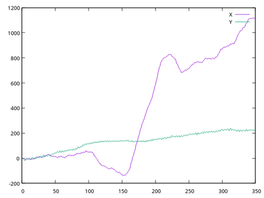
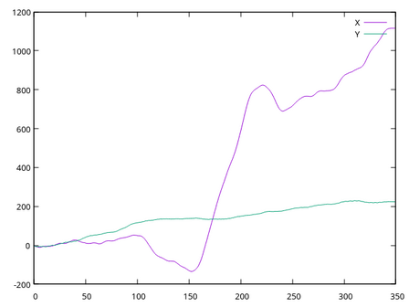

# Video Stabilization

The goal is to create a smooth video from shaky input of e.g. a hand-held camera.

### Example

#### Final result
 

#### Actual Camera Path vs (Estimated) Virtual Camera Path
 

### Method
Focus lies on estimating the virtual camera path (x and y axis) to then be able to adjust the actual camera path accordingly. Calculating the movement between each pair of consecutive images is the first step. ORB is used to generate image features and then a brute force matcher is applied to get pairs of keypoints, representing potentially equal parts of the images. Lowe's ratio test is used to filter matches and RANSAC is used to calculate the general image offset. Choosing a random sample, if enough other keypoints ("inliers") agree to the offset, it gets chosen. The median of those inliers will be the final estimation. After calculating all individual movements between frames, they get accumulated iteratively to produce the trajectory. Weighted averaging over a fixed size window is used to smoothen this trajectory. The result is the desired virtual camera path, the trajectory we believe to be the intended camera movement excluding shakes. Subtracting it from the original trajectory / actual camera path provides the offsets which describe how much each frame has to be shifted to look like it was taken along the virtual camera path. The only things left are to apply each offset to it's respective frame and add a small zoom of e.g. 4% to hide black borders and the video is successfully stabilized.

### Data
Water cooler dataset at https://pages.cs.wisc.edu/~lizhang/projects/lfstable/ was used for testing and showcasing.